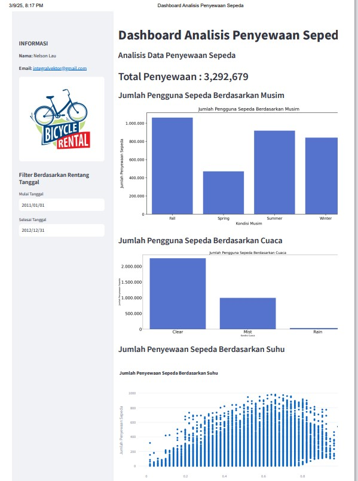

# Submission Dicoding "Belajar Analisis Data dengan Python"

## Project Analisis Data Dengan Python
Repository ini berisi projek data analisis yang saya kerjakan dan akan di deployment di Streamlit

## Deskripsi
Proyek ini bertujuan untuk menganalisis data dari Bike Sharing Dataset, dengan tujuan akhir menghasilkan wawasan dan informasi berharga dari hasil analisis data.

## Strutkur Direktori
1. data: Direktori yang menyimpan data yang digunakan dalam proyek, dalam format .csv.
   ```
2. dashboard: Direktori yang berisi main.py, digunakan untuk membangun dashboard hasil analisis data.
   ```
3. notebook.ipynb: File yang digunakan untuk melakukan analisis data secara eksploratif.
## Instalasi
Berikut adalah langkah-langkah yang diperlukan untuk menjalankan dashboard di komputer lokal:
1. Akses Clone repository menggunakan perintah berikut pada terminal.
   ```
   git clone [https://github.com/NelsonSBY/bike-share-analysis-project]
   ```
2. Instal pustaka-pustaka untuK menjalankan Pemograman Python dengan menjalankan perintah berikut.
   ```
   pip install -r requirements.txt
   pip install streamlit
   ``` 
## Run Streamlit
Akses direktori proyek di komputer lokal Anda, lalu jalankan dashboard.py dengan perintah berikut
```
cd bike-sharing/dashboard/
streamlit run dashboard.py
```
Jika berhasil, maka akan muncul tampilan seperti berikut.

